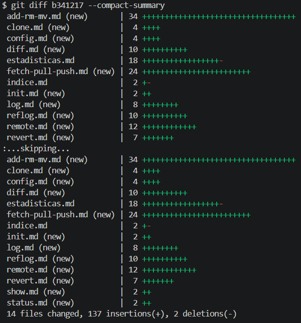
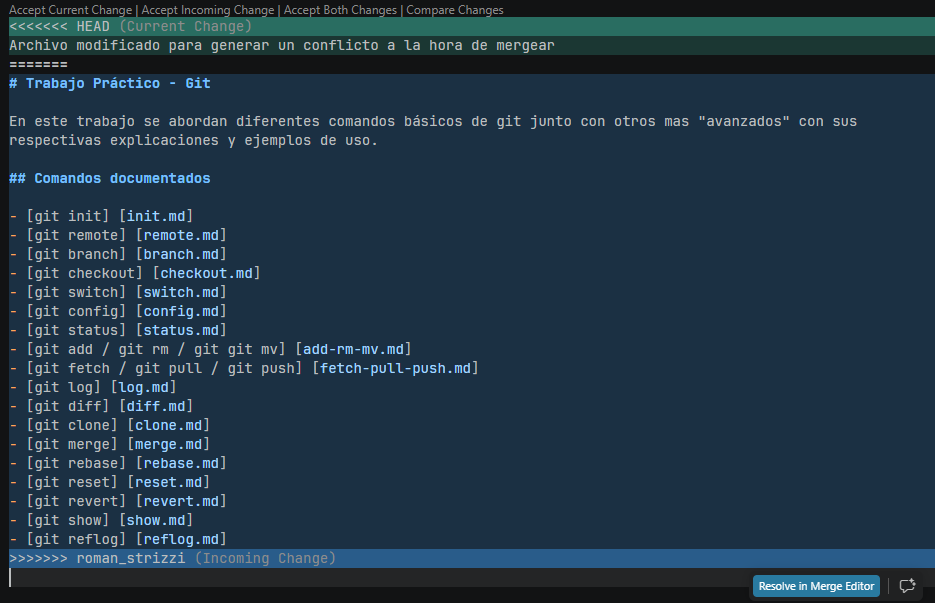

# Integrante con mayor cantidad de commits:
romanst(Román Strizzi) con 21 commits. Comando: git shortlog -sne --all.

# Cantidad total de merges realizados:
10 merges. Comando: git rev-list --merges --count --all.

# Cantidad de conflictos:
0 conflictos actualmente. Comando: git diff --name-only --diff-filter=U | wc -l.

# Cantidad de ramas en el repositorio (remoto):
6 ramas. Comando: git branch -r | wc -l.

# Commit con mayor cantidad de archivos modificados:
El commit con el hash b341217 con 14 archivos modificados. Comando: git log --all --name-only --oneline | awk '/^[0-9a-f]{7,40}/ {commit=$1; next} NF {files[commit]++} END {for (c in files) print files[c], c}' | sort -nr | head -n 1.
Diff con todos los cambios:

# Captura de un conflicto:
Este es el conflicto que generó el commit con el hash (hash):
